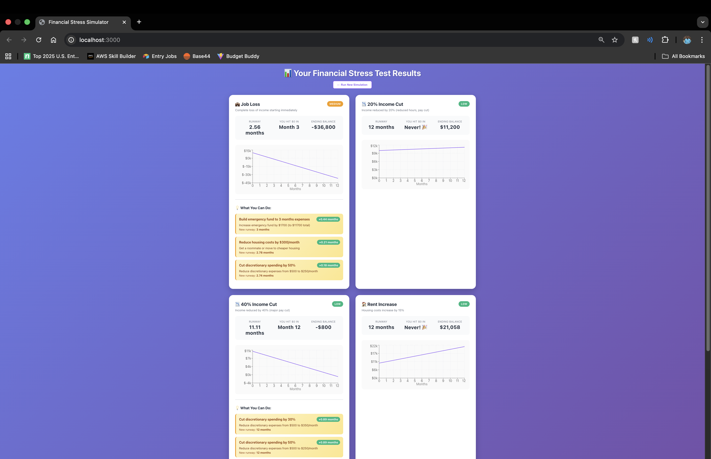
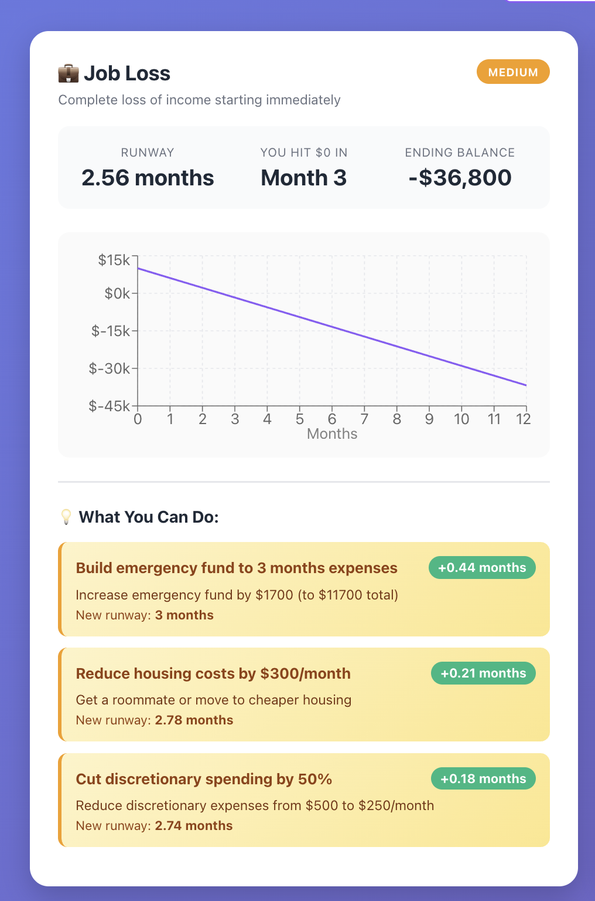

# Finance Stress Simulator

A financial stress simulator that models "what-if" scenarios and provides actionable recommendations to extend your financial runway.

[](https://finance-stress-simulator-deploy-ymu3-bvhfyuzfc.vercel.app)
[](https://finance-stress-simulator-api.onrender.com)

## 🎯 What It Does

Most finance apps show you the present. This models the future under stress:

- **Scenarios**: Job loss, income cuts, rent increases, emergencies, inflation
- **Runway Analysis**: How many months until you hit $0?
- **Risk Assessment**: High/Medium/Low risk scoring
- **Actionable Levers**: Concrete recommendations with quantified impact
## 📸 Screenshots

### Input Form


### Results Dashboard


### Scenario Detail

## 🔗 Project Suite Connection

This is the third project in a connected fintech suite:

1. **Budget Buddy** → Captures real spending behavior
2. **Cost of Living Calculator** → Provides location baseline assumptions
3. **Stress Simulator (this)** → Models fragility + tradeoffs under shocks

**Technical Connection**: This app calls your Cost of Living Calculator API to auto-fill baseline expense assumptions by city. When COL API is unavailable, it falls back to cached data.

## 🏗️ Architecture

```
Backend (FastAPI + Python)
├── Domain Logic (pure Python, no framework deps)
│   ├── Scenario Engine (6 default scenarios)
│   ├── Financial Simulator (month-by-month modeling)
│   └── Levers Calculator (actionable recommendations)
├── API Layer (FastAPI routes)
├── Database (PostgreSQL + SQLModel)
└── External Integration (COL API client)
```

**Why Python + FastAPI?**
- Financial modeling is naturally Python territory
- Demonstrates backend language diversity (vs Node.js in other projects)
- Fast, modern, and typed

## 📊 Key Features

### Scenarios Modeled
1. **Job Loss** - Complete income loss
2. **Income Cuts** - 20% or 40% reduction
3. **Rent Increase** - 15% housing cost spike
4. **Emergency Expense** - $1,500 one-time shock
5. **Inflation Spike** - 5% annual increase in essentials

### Intelligent Recommendations
For each scenario, the app calculates:
- Impact of cutting discretionary spending (10%, 20%, 30%)
- Impact of reducing housing costs (roommate, cheaper location)
- Impact of side income ($300-500/month)
- Emergency fund targets (3-6 months)

Each recommendation shows **+months of runway gained**.

## 🚀 Tech Stack

**Backend:**
- FastAPI (modern Python web framework)
- SQLModel (SQL databases with Python type hints)
- PostgreSQL (data persistence)
- Pydantic (data validation)
- httpx (async HTTP client for COL API)
- pytest (testing)

**Deployment:**
- Backend: Render / Railway / Fly.io
- Database: Managed PostgreSQL
- Frontend: Vercel / Netlify

## 📁 Project Structure

```
backend/
├── app/
│   ├── core/           # Config, DB connection
│   ├── models/         # SQLModel database models
│   ├── domain/         # Pure business logic (testable!)
│   │   ├── scenarios.py
│   │   ├── simulator.py
│   │   └── levers.py
│   ├── services/       # External integrations (COL API)
│   ├── api/
│   │   └── routes/     # FastAPI endpoints
│   ├── tests/          # Unit tests
│   └── main.py         # FastAPI app
├── data/               # Fallback data
└── pyproject.toml      # Dependencies
```

## 🔑 API Endpoints

### Snapshots
- `POST /api/snapshots` - Create financial snapshot
- `GET /api/snapshots/{id}` - Get snapshot
- `GET /api/snapshots` - List recent snapshots

### Simulations
- `POST /api/simulate` - Run simulations for a snapshot
- `GET /api/simulate/scenarios` - List available scenarios
- `GET /api/simulate/snapshots/{id}/results` - Get all results for snapshot

### Health
- `GET /health` - Health check
- `GET /` - API info

## 📚 Example API Usage

### 1. Create a snapshot
```bash
POST /api/snapshots
{
  "city": "San Francisco, CA",
  "monthly_income_takehome": 6000,
  "emergency_fund_balance": 15000,
  "essential_total": 3500,
  "discretionary_total": 1200,
  "use_col_baseline": false
}
```

### 2. Run simulations
```bash
POST /api/simulate
{
  "snapshot_id": "uuid-here"
}
```

Returns:
```json
{
  "snapshot_id": "uuid",
  "results": [
    {
      "scenario_type": "job_loss",
      "runway_months": 3.2,
      "breach_month": 4,
      "risk_level": "high",
      "top_levers": [
        {
          "label": "Cut discretionary spending by 50%",
          "delta_months": 1.8,
          "new_runway_months": 5.0
        }
      ]
    }
  ]
}
```

## 🎓 What I Learned

- **Domain-Driven Design**: Separating business logic from infrastructure
- **Financial Modeling**: Month-by-month simulation with compound effects
- **Python Type Safety**: Using Pydantic and SQLModel for type-safe Python
- **Async Python**: httpx for non-blocking external API calls
- **Testing Domain Logic**: Pure functions make testing easy

## 🎨 Design Decisions

### Why separate domain logic?
The `domain/` folder contains pure Python with zero framework dependencies. This means:
- Easy to test (no mocking FastAPI/DB)
- Easy to reuse (could wrap in Django, Flask, CLI, etc.)
- Clear business logic separation

### Why store results as JSON?
Scenarios evolve. Storing results as JSON in the database allows adding fields without migrations.

### Why COL API integration?
Demonstrates:
- Calling external APIs from backend
- Graceful degradation (fallback data)
- Real technical connection between projects

## 🔮 Future Enhancements

- [ ] Monte Carlo mode (probabilistic scenarios)
- [ ] CSV import from Budget Buddy
- [ ] Multi-scenario comparison view
- [ ] Savings goal modeling
- [ ] Debt payoff optimization
- [ ] Tax impact modeling

## 📝 License

MIT

---

**Part of the Connected Fintech Suite:**
- [Budget Buddy](https://github.com/pelzade127/budget-buddy-frontend)
- [Cost of Living Calculator](https://github.com/pelzade127/cost-of-living-calculator)
- Finance Stress Simulator (you are here)
